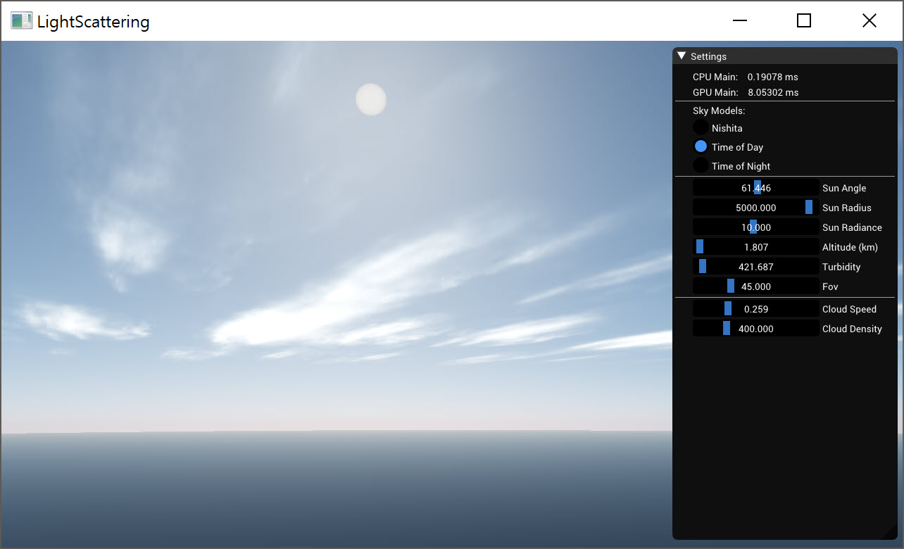
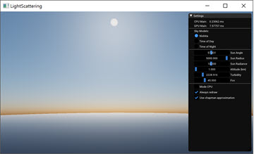
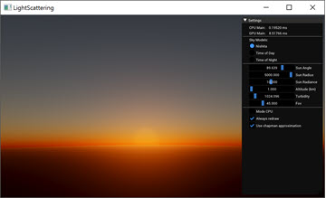
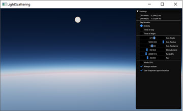
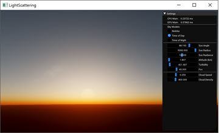

Rendering atmospheric scattering

[method]

1. Nishita: based on Nishita's algorithm and ported to GPU
2. Time of day: use code ray-mmd skybox
3. Time of night: use code ray-mmd skybox

[Nishita]

[Ray-MMD]

[reference]

1. [Nishita93] Nishita, 1993, "Display of the Earth Taking into account Atmospheric Scattering"
2. [ScratchPixel] Simulating the Colors of the Sky, https://www.scratchapixel.com/lessons/procedural-generation-virtual-worlds/simulating-sky
3. [Shuler12] Shuler, 2012, "An Approximation to the Chapman GrazingIncidence Function for Atmospheric Scattering"
4. [Hillaire16] Sebastien Hillaire, 2016, Physically Based Sky, Atmosphere and Cloud Rendering in Frostbite
5. [Gustav14] Gustav Bodare, 2014, Efficient and Dynamic Atmospheric Scattering 
 
 [Note]
 
1. Nishita method examples: https://bensimonds.com/2014/10/02/atmospheric-rendering-with-osl/ 
